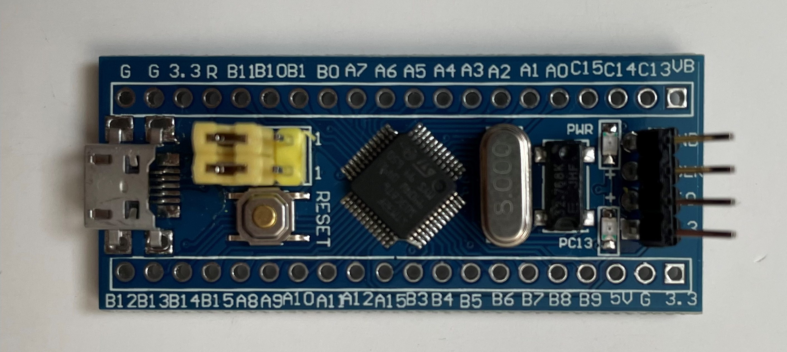
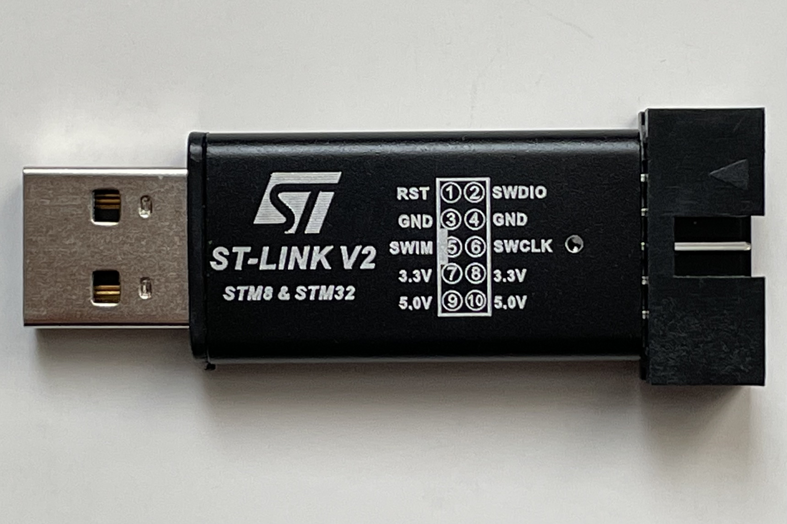
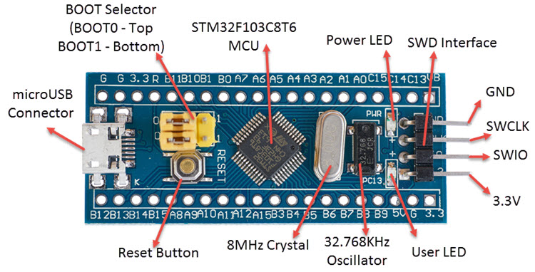
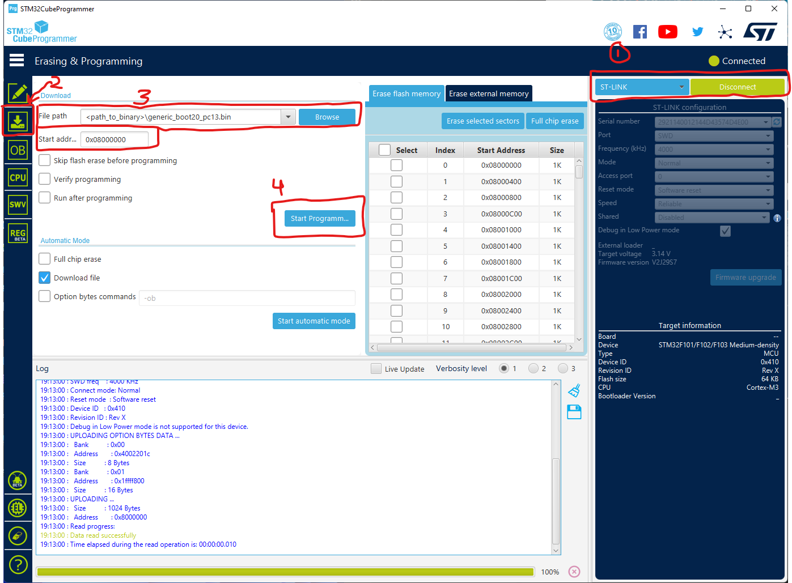
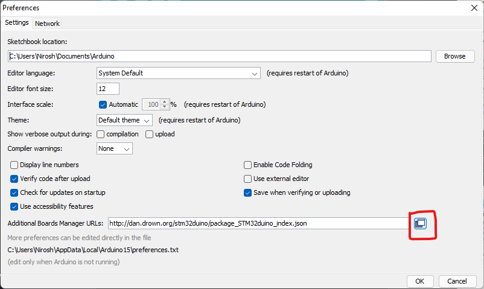
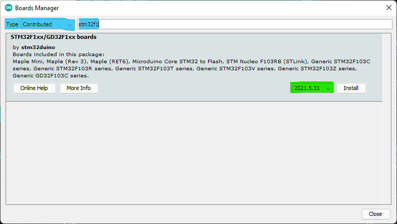

# Bootloading the Arduino Blue Pill

The Arduino Blue Pill does not ship with a bootloader installed, this means 
we cannot easily connect and upload builds to it using the attached USB type-B
connector. To allow us to use a USB connection instead of flashing builds using
the ST-Link V2, this doc will setup a bootloader which allows us to connect to 
the Arduino using just the Arduino IDE.

## Materials

### Arduino Blue Pill


** The pins on the right hand side are manually bent upwards to prevent 
interference between the Arduino Blue Pill and the relay on the PDU.

### ST-Link V2 


You will also need four jumper wires to connect to the Blue Pill.

## Bootloader Setup

To start we will need to get the following:

- [ST-Link V2 driver](https://www.st.com/en/development-tools/stsw-link009.html)
- [STM32CubeProgrammer](https://www.st.com/en/development-tools/stm32cubeprog.html)
- Download the bootloader binary on [GitHub](https://github.com/rogerclarkmelbourne/STM32duino-bootloader/blob/master/binaries/generic_boot20_pc13.bin) or in the 
[resources](resources) folder

You will be asked to provide your name and email to download the content from
the ST website. Once you've downloaded and installed all the sofware and 
drivers, we will need to move the `BOOT0` select from `0` to `1`. This simply
involved pulling out the top yellow selector, and moving it to the right hand
pins so they bridge the middle and right pins.



### STM32CubeProgrammer

1. Open STM32CubeProgrammer, on the right hand side select `ST-LINK` from the 
   blue drop down then select `Connect` 
2. Select the `Erasing & Programming` tab on the left-hand side of the program
3. Select the file path to the bootloader binary and ensure the starting 
   address is `0x08000000`
4. Program the Blue Pill by clicking `Start Programming`

If all goes well, you should see a dialog box saying 
`"File download complete"`. The bootloader is now on the Blue Pill. Now that
we're done, **MOVE THE `BOOT0` bridge back to the `0` position**. It will not
show up properly when plugged into a USB port on your PC otherwise.



### Arduino IDE Setup

Once you have **moved the `BOOT0` bridge back to the `0` position**, plug in 
the Blue Pill using a type-B USB cable into your PC.

1. Grab the latest stable release of the 
   [Arduino IDE](https://www.arduino.cc/en/software) and install it on your
   machine. **DO NOT install the Microsoft Store version**, instead download
   the executable file directly off the website.

   
2. Configure Board Manager Sources

Under `File >> Preferences` click on the button to the right of the
`Additional Boards Manager URLs:` textbox and add the following on a new line:

```
http://dan.drown.org/stm32duino/package_STM32duino_index.json
```


---

3. Configure Board Manager

Under `Tools >> Board >> Board Manager` choose the `Contributed` type from the 
drop down and then search for `"stm32f1"`. Here you will see a package from
stm32duino. We have only tested this procedure for `v2021.5.31`.


---

## References
- [Programming STM32 Board Blue Pill using native USB port](https://www.youtube.com/watch?v=e0CP2IpIBg4&ab_channel=IOTES)