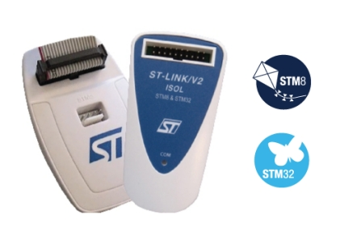
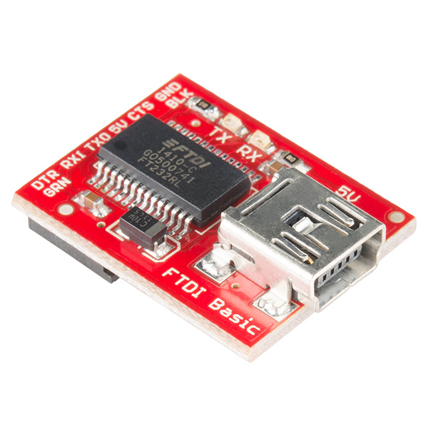

# Installation

## Prerequisites

To start we will need to get the following:

- [ST-Link V2 driver](https://www.st.com/en/development-tools/stsw-link009.html)
- [STM32CubeProgrammer](https://www.st.com/en/development-tools/stm32cubeprog.html)

## BOOT Selector

You will be asked to provide your name and email to download the content from
the ST website. Once you've downloaded and installed all the sofware and 
drivers, we will need to move the `BOOT0` select from `0` to `1`. This simply
involved pulling out the top yellow selector, and moving it to the right hand
pins so they bridge the middle and right pins. Moving the bridge to the `1` 
position simply puts it into programming mode instead of run mode.


## Materials

### Arduino Blue Pill


** The pins on the right hand side are manually bent upwards to prevent 
interference between the Arduino Blue Pill and the relay on the PDU.

### ST-Link V2 


You will also need four jumper wires to connect to the Blue Pill.

### FTDI Serial Board (Optional but recommended)


## Arduino IDE Setup

1. Grab the latest stable release of the 
   [Arduino IDE](https://www.arduino.cc/en/software) and install it on your
   machine. **DO NOT install the Microsoft Store version**, instead download
   the executable file directly off the website.

2. Under `File >> Preferences` click on the button to the right of the
   `Additional Boards Manager URLs:` textbox and add the following on a new 
   line: `https://github.com/stm32duino/BoardManagerFiles/raw/main/package_stmicroelectronics_index.json`
   ([screenshot](images/ide-json-preferences.png) *note the URL in the 
   screenshot may not be accurate.)

3. Under `Tools >> Board >> Board Manager` choose the `Contributed` type from 
   the drop down and then search for `"STM32 MCU based boards"`. Here you will
   see a package from STMicroelectronics. We have only tested this procedure 
   for `v2.2.0`.

## Blue Pill Drivers

We will now need to install Blue Pill drivers and COM drivers to communicate 
with the Arduino.

1. Download the ZIP file of the Arduino_STM32 GitHub
   [repo](https://github.com/rogerclarkmelbourne/Arduino_STM32)

2. Extract the files, rename the extracted folder to `Arduino_STM32`

3. Move the folder to `C:\Users\<User_Account>\Documents\Arduino\hardware`
   if the `hardware` folder does not exist, create it. The final directory
   structure should look as follows:

```
Arduino
├── hardware
│   └── Arduino_STM32
│     ├── LICENSE
│     ├── README.md
│     ├── STM32F1
│     ├── STM32F4
│     ├── drivers
│     └── tools
└── libraries
    └── readme.txt
```

4. In the `<Arduino Path>\hardware\Arduino_STM32\drivers\win` directory, 
   run the `install_drivers.bat` and `install_STM_COM_drivers.bat` files by
   executing them in an admin Command Prompt manually or by right clicking the
   file and selecting `Run as administrator`. Install them one by one. Now 
   **restart your desktop**.

5. Reconnect the Blue Pill. If its already attached, disconnect and reconnect.
   If a popup comes up saying to run `wdi-simple` allow it to run.

6. Restart your Arduino IDE.

## Configuring Arudino Blue Pill in Arduino IDE

1. Open your Arduino IDE, open the `Tools` dropdown from the menu bar.

2. Select the appropriate board by selecting
   `Board: <"Something"> >> STM32 boards group >> Generic STM32F1 series`

3. Verify the following settings in the same `Tools` menu:

```
Board: Generic STM32F1 series
Board part number: BluePill F103C8
U(S)_ART support: Enabled (generic 'Serial')
USB support (if available) : None
USB speed (if available): Low/Full Speed
Optimize: Smallest (-Os default)
Debug symbols: None
C Runtime Library: Newlib Nano (default)
Upload method: STM32CubeProgrammerSWD
```

## Installing the eXoCAN Library

Use the [Libraries Guide](libraries.md) to manually install the eXoCAN library
in the [libraries](../libraries) folder.

## Test the Code

When flashing code to the Arduino, place the `BOOT0` pin to the `1` position,
if you are not flashing code and simply want to run existing code on the Blue 
Pill's memory, place the jumper on the `0` position.

1. Create a sketch with the [exo_can_simple_test](../src/exo_can_simple_test)
   code in the Arduino IDE.

2. Click the verify button - the check mark icon on the top left of the IDE

3. Click the upload button - the right hand arrow on the top left of the IDE.

## Grabbing Serial Logging

1. Connect the FTDI board ([screenshot](images/ftdi-pinout.png))

2. Download the drivers from the
   [VCP site](https://ftdichip.com/drivers/vcp-drivers/)

3. Select the appropriate Port as `COM<N>` from the `Tools` menu

4. Open up the Serial Monitor from the menu: `Tools >> Serial Monitor`
