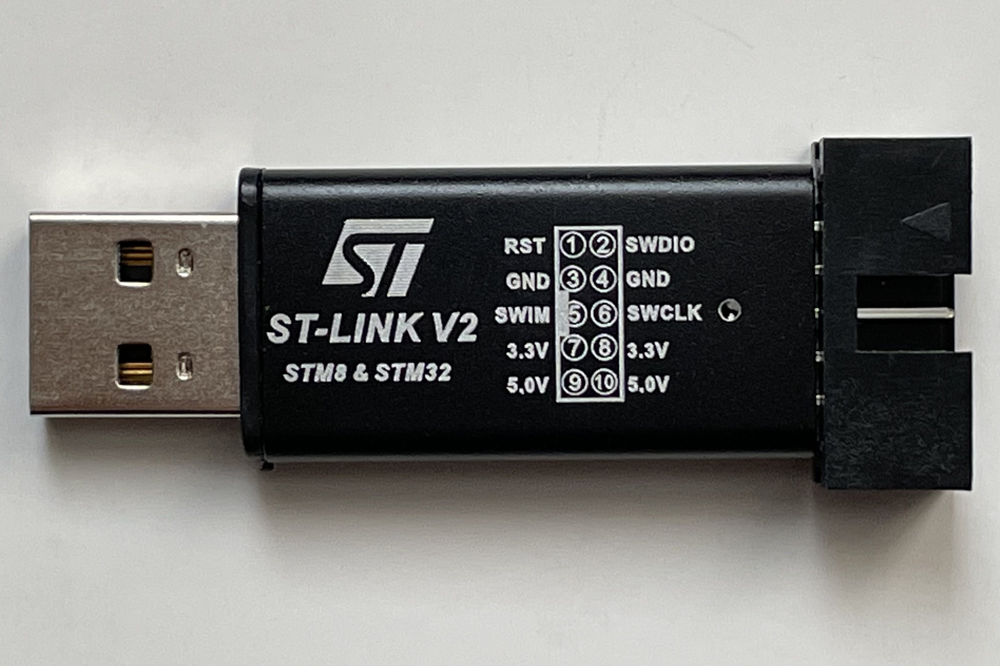
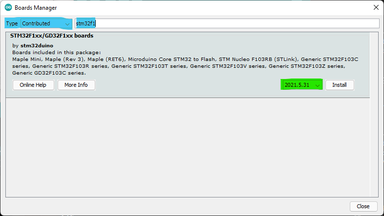

# Installation

## Summary
This guide will walk you through installation of the software and drivers 
necessary to get the Arduino Blue Pill up and running on your machine. Follow
these steps carefully - skipping steps or running executing steps our of order
may result in undesired behaviour.

## Materials

### Arduino Blue Pill


** The pins on the right hand side are manually bent upwards to prevent 
interference between the Arduino Blue Pill and the relay on the PDU.

### ST-Link V2 


You will also need four jumper wires to connect to the Blue Pill.

## Software Setup

### 1. Arduino IDE
---
Grab the latest stable release of the 
[Arduino IDE](https://www.arduino.cc/en/software) and install it on your 
machine.

### 2. Configure Board Manager Sources
---
Under `File >> Preferences` click on the button to the right of the
`Additional Boards Manager URLs:` textbox and add the following on a new line:

```
https://github.com/stm32duino/BoardManagerFiles/raw/master/STM32/package_stm_index.json
```


### 3. Configure Board Manager
---
Under `Tools >> Board >> Board Manager` choose the `Contributed` type from the 
drop down and then search for `"stm32 cores"`. Here you will see a package from
STMicroelectronics. We have only tested this procedure for `Version 1.3.0`, 
in other words, **DO NOT download the latest version, choose v1.3.0**.



This process will take a while to download and install. Take a break, grab some
water.

### 4. Installing Drivers
---
Download and install the latest ST-Link V2 
[driver](https://www.st.com/en/development-tools/stsw-link009.html). Following
the installation restart your Windows machine.

### 5. Compiling and Uploading Code
---

#### Setup
Under the `Tools` menu, ensure you see the following settings:
```
Board: Generic STM32F103 Series
Board part number: BluePill F103C8
Serial Interface: Enabled with generic Serial
Flash Memory Size: 64k (you can try 128k; most boards are sold as 64k but in fact have 128k of flash)
Upload method: STLink
```

#### Code
Now we have everything we need to run a program on the Arduino Blue Pill.
Let's load a simple program from the IDE's build-in examples, you can find
them in `File >> Examples >> 01.Basics >> Blink`. It contains the following
code:

```C
/*
  Blink

  Turns an LED on for one second, then off for one second, repeatedly.

  Most Arduinos have an on-board LED you can control. On the UNO, MEGA and ZERO
  it is attached to digital pin 13, on MKR1000 on pin 6. LED_BUILTIN is set to
  the correct LED pin independent of which board is used.
  If you want to know what pin the on-board LED is connected to on your Arduino
  model, check the Technical Specs of your board at:
  https://www.arduino.cc/en/Main/Products

  modified 8 May 2014
  by Scott Fitzgerald
  modified 2 Sep 2016
  by Arturo Guadalupi
  modified 8 Sep 2016
  by Colby Newman

  This example code is in the public domain.

  https://www.arduino.cc/en/Tutorial/BuiltInExamples/Blink
*/

// the setup function runs once when you press reset or power the board
void setup() {
  // initialize digital pin LED_BUILTIN as an output.
  pinMode(LED_BUILTIN, OUTPUT);
}

// the loop function runs over and over again forever
void loop() {
  digitalWrite(LED_BUILTIN, HIGH);   // turn the LED on (HIGH is the voltage level)
  delay(1000);                       // wait for a second
  digitalWrite(LED_BUILTIN, LOW);    // turn the LED off by making the voltage LOW
  delay(1000);                       // wait for a second
}
```

#### Compile and Upload

Now you can click the `Verify` button on the top left of the IDE. Once it 
successfully completes, click the `Upload` button to the right of `Verify`.
If it works correctly, it will look like this:


## References
 - [How to program a STM32 "Blue Pill" with Arduino](https://idyl.io/arduino/how-to/program-stm32-blue-pill-stm32f103c8t6/)