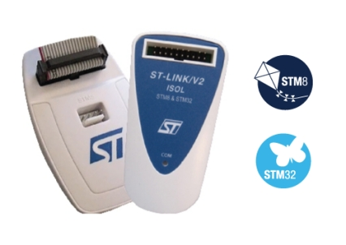

# Current Sensing on the Arduino Blue Pill

## Software Installation

Follow setups listed in [installation guide](../../docs/installation.md).

## Equipment and Bench Testing

We will need the official OEM ST Link V2, the knockoff devices don't seem to work and can be incompatible at times. To ease CAN communication we will also use an external transciever to facilitate communication on the CAN bus - this will require 2 120 ohm resistors. Finally, mimic the setup below.

